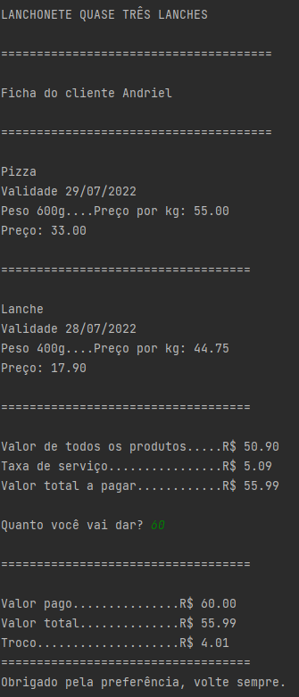

# lanchonete

- A lanchonete possui 3 principais itens de venda: pizzas, lanches e salgadinhos. Inicialmente, o sistema será testado para controlar as vendas desses 3 itens apenas. 
- Todos os itens vendidos devem conter: preço de venda, data de validade e peso. 
- O sistema da nossa lanchonete deverá criar um pedido, esse pedido será composto pelo nome do cliente, itens que foram consumidos e taxa de serviço. 
- O sistema deve permitir gerar a nota fiscal para entregar ao cliente. 
- O vendedor poderá inserir o valor recebido em dinheiro e o sistema calcula e mostra o troco do cliente na tela.

 
